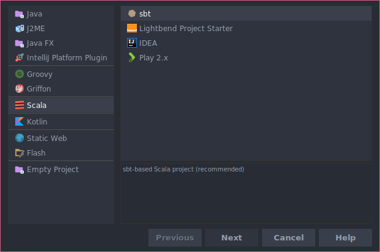
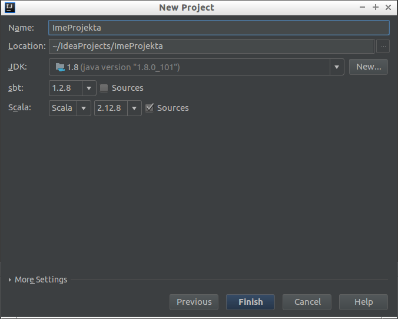

# Jezik Scala

**Scala** (skr. *Scalable Language*) je moderni programski jezik kreiran od strane Martina Odersky-a 2003. napravljen sa ciljem da integriše osobine objektno-orijentisanih i funkcionalnih programskih jezika.

## Literatura:

1. [Scala Tour](https://docs.scala-lang.org/tour/tour-of-scala.html)
2. [Tutorialspoint Scala](https://www.tutorialspoint.com/scala/)
3. Master rad koleginice Ane Mitrović na temu primena Scala jezika u paralelizaciji rasplinutog testiranja: [Rad Ane Mitrović](http://www.racunarstvo.matf.bg.ac.rs/MasterRadovi/2016_05_04_Ana_Mitrovic/rad.pdf)

## Neke osnovne osobine:

1. **Scala je objektno-orijentisani jezik**  
   Svaka vrednost je objekat, klase se mogu nasledjivati i postoje mehanizmi koji služe kao zamena za višestruko nasledjivanje.
   
2. **Scala je funkcionalni jezik**  
   Svaka funkcija se tretira kao vrednost i svaka vrednost je objekat - dakle, svaka funkcija je objekat.
   
3. **Scala daje konstrukte za konkurentno i sinhronizovano procesiranje.**

4. **Scala je statički tipiziran jezik.**

5. **Scala operiše na JVM.**

6. **Scala može pokretati Java kod.**

## Neke osnovne razlike u odnosu na Javu:

1. Svi tipovi su objekti (nema primitivnih tipova).
2. *Type-inference* - tipovi se mogu dedukovati od strane prevodioca.
3. Funkcije se posmatraju kao objekti.
4. Osobine, engl. *Traits* - enkapsuliraju definicije polja i metoda.
5. Zatvorenja, engl. *Closures* - funkcije čije povratne vrednosti zavise od promenljivih deklarisanih van te funkcije.
6. Ne postoje statičke klase, umesto njih se koriste objekti (singletoni).

# Instalacija potrebnih alata

Koristimo jezik `Scala` (verzija 2.12.8) [scala-lang.org](http://www.scala-lang.org/).

Potrebno je imati instalirano:

1. `IntelliJ Idea` [JetBrains IntelliJ IDEA](https://jetbrains.com/idea/)
2. Scala plugin za `IntelliJ Idea`

## Pravljenje projekta

Koristi se `sbt` (eng. Simple build tool) (koji će kasnije preuzeti i konfigurisati dodatne biblioteke za nas).

Na slici ispod je prikazano kako u okruženju odabrati `sbt` projekat.

Za pravljenje `sbt` projekta **neophodno** je imati aktivnu internet konekciju.



## Inicijalizacija projekta

Okruženje se sada inicijalizuje, detektuju se Scala biblioteke i slično.  
Ovaj proces može da potraje od nekoliko sekundi do nekoliko minuta u zavisnosti od brzine mrežne konekcije i hardvera računara, te treba biti strpljiv.

U donjem delu okruženja na sredini možete čitati poruke o tome šta se trenutno dešava, na primer:
```
sbt: dump project structure from sbt
```
je jedan od koraka koje IntelliJ mora da izvrši kako bi pripremio sve za rad.

## Konfiguracija projekta

Odaberite gde želite da se napravi projekat.  
Preporučeno je da imate direktorijum u kojem čuvate sve `IntelliJ Idea` projekte (uglavnom je to `home/korisnik/IdeaProjects`).

Za `sbt` i jezik `Scala` odaberite:
- `sbt: 1.2.max (1.2.8)`
- `Scala: 2.12.max (2.12.8)`

Na slici ispod prikazano je gde treba odabrati verzije za `sbt` i jezik `Scala`.

Kliknite `Finish`.



