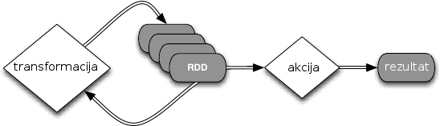
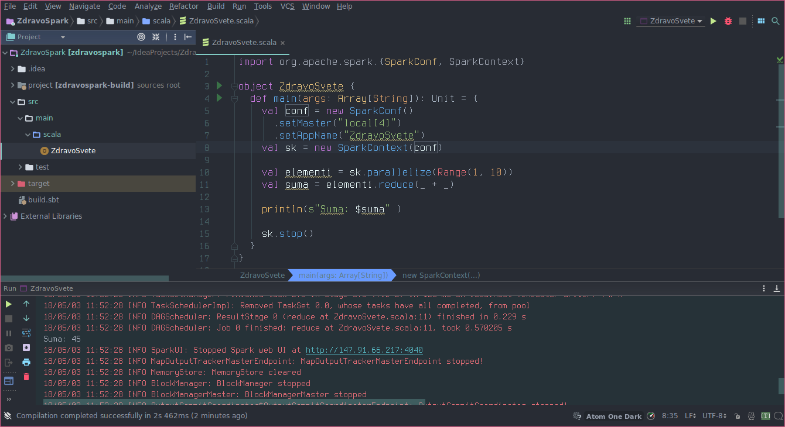

# O Apache Spark-u

**Apache Spark** je radni okvir (eng. framework) za distribuirano
programiranje. Pruža interfejse za programiranje (eng. API) u jezicima
Java, Scala, Python i R.

Svaka Spark aplikacija se sastoji od glavnog (eng. *driver*) programa
koji pokreće funkciju `main` i izvršava paralelne operacije na povezanom
klaster računaru. Pristupanje klaster računaru se vrši pomoću objekta
kontekst tipa `SparkContext`. Prilikom konstrukcije kontekst objekta,
potrebno je definisati koji klaster računar će se koristiti. Spark
aplikacija može koristiti lokalni računar kao simulaciju klaster
računara (svaka procesorska jedinica će simulirati jedan čvor klaster
računara) ili neki udaljeni klaster računar.

Spark koristi posebne kolekcije podataka koje se mogu obrađivati
paralelno (eng. *RDD - Resilient Distributed Datasets*). Paralelne
kolekcije se mogu napraviti od već postojećih kolekcija u programu ili
se mogu učitati iz spoljašnjeg sveta. Nad paralelnim kolekcijama možemo
izvršavati dva tipa operacija *transformacije* i *akcije* (slika
[1](#fig:spark){reference-type="ref" reference="fig:spark"}).
Transformacije transformišu kolekciju na klaster računaru i prave novu
paralelnu kolekciju. Sve transformacije su lenje, što znači da rezultat
izračunavaju u trenutku kada on postane potreban.

Akcije su operacije koje se izvršavaju na klaster računaru nad
paralelnim kolekcijama i njihov rezultat (izračunata vrednost) se vraća
na lokalni računar.



Spark može da sačuva paralelne kolekcije u memoriji čvorova klaster
računara i na taj način ubrzati izvršavanje narednih operacija.

Spark pruža mogućnost koriščenja deljenih podataka u vidu emitovanih
promenljivih (eng. *broadcast variables*) i akumulatora (eng.
*accumulators*).

Neke od funkcija transformacija su:

1.  `map(f)` - vraća novu kolekciju koja se dobija tako što se primeni
    funkcija f nad svakim elementom postojeće kolekcije

2.  `filter(f)` - primenjuje funkciju f nad svim elementima kolekcije i
    vraća novu kolekciju koja sadrži one elemente za koje je funkcija f
    vratila true

3.  `flatMap(f)` - slična je funkciji map, razlika je to što primena
    funkcije f nad nekim elementom kolekcije može da vrati 0 ili više
    novih elemenata koji se smeštaju u rezultujuću kolekciju

4.  `groupByKey()` - poziva se nad kolekcijom parova (kljuc, vrednost) i
    vraća kolekciju parova (kljuc, Iterable\<vrednost\>) tako što
    grupiše sve vrednosti sa istim ključem i smešta ih u drugi element
    rezultujućeg para

5.  `reduceByKey(f)` - poziva se nad kolekcijom parova (kljuc, vrednost)
    i vraća kolekciju parova (kljuc, nova_vrednost) , nova_vrednost se
    dobija agregiranjem svih vrednosti sa istim ključem koristeću zadatu
    funkciju agregacije f

6.  `aggregateByKey(pocetna_vrednost)(f1, f2)` - poziva se nad
    kolekcijom parova (kljuc, vrednost) i vraća kolekciju parova (kljuc,
    nova_vrednost) , nova_vrednost se dobija agregiranjem pocetne
    vrednosti i svih vrednosti sa istim ključem koristeću zadatu
    funkciju agregacije f1 u svakom čvoru klaster računara, a funkcija
    f2 agregira vrednosti izračunate u čvorovima klaster računara u
    jednu vrednost - nova_vrednost

7.  `sortByKey()` - poziva se nad kolekcijom parova (kljuc, vrednost) i
    vraća novu kolekciju sortiranu po ključu

8.  `cartesian(druga_kolekcija)` - spaja kolekciju sa drugom kolekcijom
    i vraća kolekciju svih parova
    (vrednost_iz_prve_kolekcije,vrednost_iz_druge_kolekcije)

9.  `zip(druga_kolekcija)` - spaja kolekciju sa drugom kolekcijom
    spajajući elemente na istim pozicijama i vraća kolekciju parova
    (vrednost_iz_prve_kolekcije, vrednost_iz_druge_kolekcije)

Neke od funkcija akcija su:

1.  `reduce(f)` - agregira elemente kolekcije koristeći funkciju f i
    vraća rezultat agregacije

2.  `collect()` - pretvara paralelnu kolekciju u niz (koji se nalazi na
    lokalnom računaru)

3.  `count()` - vraća broj elemenata kolekcije

4.  `countByKey()` - poziva se nad kolekcijom parova (kljuc, vrednost),
    za svaki ključ broji koliko ima elemenata sa tim ključem i vraća
    neparalelnu kolekciju (kljuc, broj_elemenata)

5.  `first()` - vraća prvi element kolekcije

6.  `take(n)` - vraća prvih n elemenata kolekcije

7.  `takeSample(sa_vracanjem, n, seed)` - vraća prvih n nasumično
    izabranih elemenata kolekcije (sa ili bez vraćanja), seed
    predstavlja početnu vrednost generatora slučajnih brojeva

8.  `takeOrdered(n[, poredak])` - vraća prvih n elemenata sortirane
    kolekcije (koristeći prirodan poredak kolekcije ili zadati poredak)

9.  `saveAsTextFile(ime_direktorijuma)` - upisuje kolekciju u datoteke
    koje se nalaze u zadatom direktorijumu

10. `foreach(f)` - poziva funkciju f nad svim elementima kolekcije
    (uglavnom se koristi kada funkcija f ima neke sporedne efekte kao
    što je upisivanja podataka u datoteku ili slično)

Konfiguraciju Spark aplikacije možemo podešavati dinamički prilikom
pokretanja aplikacije na klaster računaru. Potrebno je upakovati
aplikaciju zajedno sa svim njenim bibliotekama u .jar datoteku koristeći
neki od alata (Maven [^1], SBT [^2] i sl.) i instalirati Spark upravljač
na klaster računaru (Standalone [^3], Mesos [^4], Yarn [^5] i sl.).
Aplikaciju možemo pokrenuti pomoci `spark-submit` skripta koji se nalazi
u `bin` direktorijumu instaliranog Spark alata i konfigurisati
dinamički. Na primer:
```bash
$ ./bin/spark-submit --class Main --master local --num-executors 20 Aplikacija.jar
```

Parametri koji se najčešće koriste prilikom konfiguracije su:
1.  `–master url` - URL klaster racunara
2.  `–class ime_klase` - glavna klasa naše aplikacije
3.  `–num-executors n` - broj čvorova koji izvršavaju našu aplikaciju
    (eng. executors)
4.  `–executor-cores n` - broj zadataka koje jedan čvor može izvršavati
    istovremeno
5.  `–executor-memory n` - veličina hip memorije svakog čvora

# Uputstvo za Apache Spark {#uputstvoDistribuirano}

Uputstvo prikazuje kako konfigurisati projekat u okruženju
`Intellij Idea` da koristi biblioteku `Apache Spark`.

Literatura:
- <spark.apache.org/docs/0.9.1/scala-programming-guide.html>

## Potreban softver i alati

Potrebno instalirati:

- [IntelliJ IDEA](jetbrains.com/idea/)
    - Plugin `Scala` za `Intellij Idea` (instalacija iz okruženja)
- [Java JDK 8](oracle.com/technetwork/java/javase/downloads/jdk8-downloads-2133151.html)

## Pravljenje projekta

Potrebno je napraviti `sbt` projekat na isti način kao i u prethodnim
odeljcima (videti uputstvo za Konkurentno programiranje).

## Dodavanje biblioteke u `build.sbt`

Potrebno je da sistemu `sbt` definišemo da naš projekat koristi spoljnu
biblioteku. U datoteci `build.sbt` možemo definisati zavisnost (eng.
*dependency*) od spoljne biblioteke.

Potrebno je dodati sledeći kod u datoteku `build.sbt`
```scala
    libraryDependencies ++= {
      val sparkVer = "2.4.0"
      Seq(
        "org.apache.spark" %% "spark-core" % sparkVer
      )
    }
```

Vaš `build.sbt` bi trebao imati sledeći oblik:
```scala
    name := "ZdravoSpark"
    version := "0.1"
    scalaVersion := "2.12.8"
    libraryDependencies ++= {
      val sparkVer = "2.4.0"
      Seq(
        "org.apache.spark" %% "spark-core" % sparkVer
      )
    }
```

Pri čemu atribut `name` zavisi od imena projekta koje ste originalno
odabrali.

Sačuvajte izmene. Kada Vas okruženje pita da ažurira projekat jer je
izmenjena datoteka `build.sbt` prihvatite izmene. Alat `sbt` će u skladu
sa Vašim izmenama preduzeti odgovarajuće akcije. U ovom slučaju to će
biti preuzimanje biblioteke `spark-core` sa odgovarajućeg repozitorijuma
i njeno uključivanje u Vaš projekat.

## Pokretanje programa

Nakon što je sbt pripremio okruženje za rad, možemo da pristupimo Spark
biblioteci. Na slici [2](#fig:startspark){reference-type="ref"
reference="fig:startspark"} je prikazano pokretanje Spark programa.



---

[^1]: <http://maven.apache.org/>
[^2]: <http://www.scala-sbt.org/>
[^3]: <http://spark.apache.org/docs/latest/spark-standalone.html>
[^4]: <http://spark.apache.org/docs/latest/running-on-mesos.html>
[^5]: <http://spark.apache.org/docs/latest/running-on-yarn.html>

